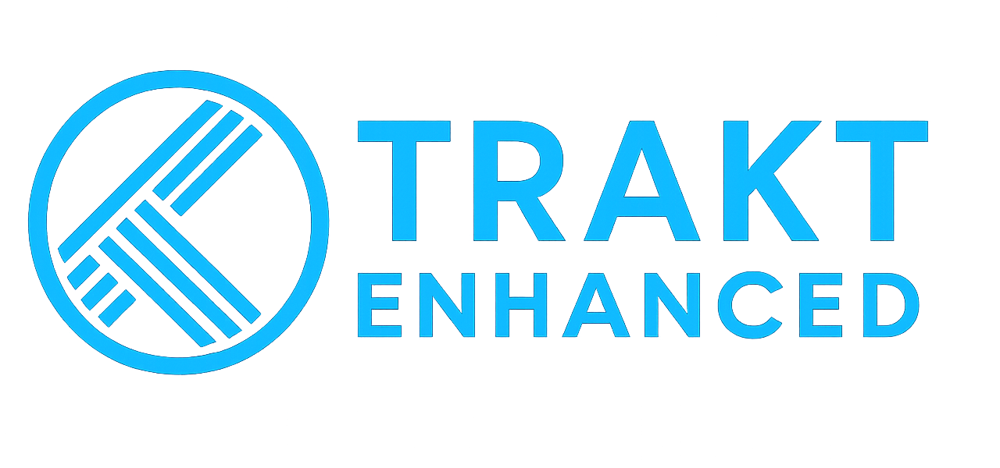
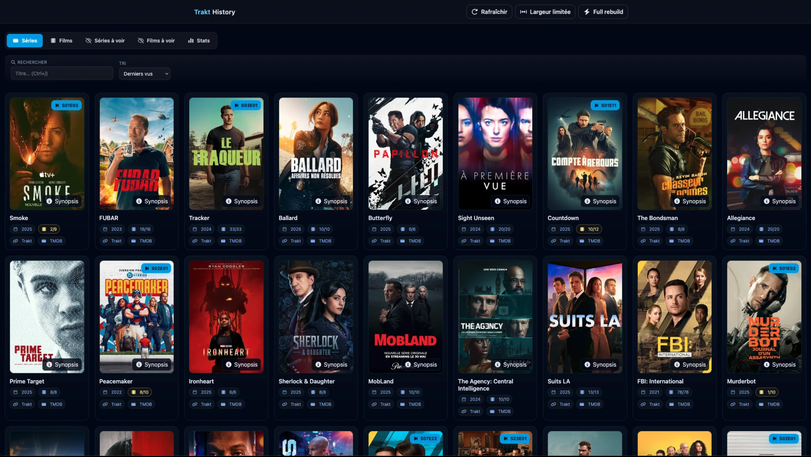
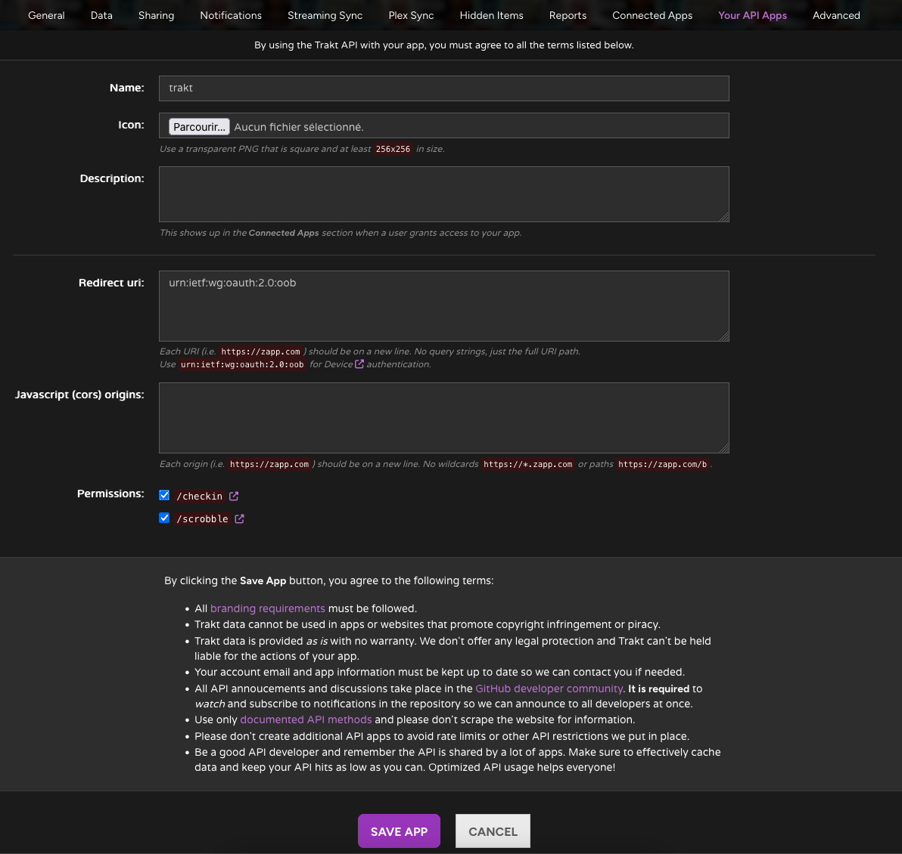
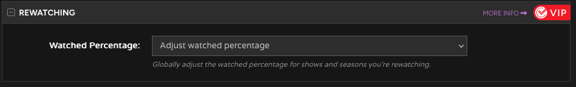

[](docs/img/title.png)

# Trakt Enhanced (Node.js, modular, HTML séparé)

[](docs/img/screenshot.webp)

App web pour parcourir ton historique **Trakt** avec :
- **UI 100% HTML** modifiable facilement (`public/app.html`)
- **Tri / recherche** (Séries, Films, Séries à voir, Films à voir)
- **Cartes** avec posters TMDB mis en cache local
- **Rafraîchissement automatique** au démarrage puis à intervalle régulier
- **Build CSS** Tailwind (sans CDN) + Font Awesome locaux


## 🚀 Installation rapide

### Installation classique (Node.js)

```bash
git clone https://github.com/diabolino/trakt_enhanced
cd trakt
cp .env.example .env
npm install
npm run build
npm start
```

### Installation Docker

📦 **[Documentation complète Docker](docker.md)**

```bash
docker run -d \
    --name=trakt_enhanced \
    -p 3000:3000 \
    -v ~/trakt/.env:/app/.env:ro \
    -v trakt_data:/app/data \
    --restart unless-stopped \
    docker.io/diabolino/trakt_enhanced:latest
```

---

## ‼️ IMPORTANT — Paramétrage Trakt

Crée une application sur **Trakt → Settings → Your API Apps** et récupère **Client ID** / **Client Secret** pour les variables d’environnement.  
Utilise le **Device Code Flow** (pas besoin d’URL de redirection).



Ajuster ce paramètres dans les réglages :
  


## ⚙️ Configuration (.env)

Variables **recommandées** :
```env
TRAKT_CLIENT_ID=xxx
TRAKT_CLIENT_SECRET=xxx
TMDB_API_KEY=xxx
SESSION_SECRET=un-secret-long
FULL_REBUILD_PASSWORD=un-autre-secret
```

Variables **optionnelles** :
```env
# Rafraîchissement auto (par défaut 1h)
REFRESH_EVERY_MS=3600000

# Les posters sont servis depuis /cache_imgs, mappé vers :
# /data/cache_imgs (si présent) ou ./data/cache_imgs (fallback)
```

---

## 🗂️ Arborescence (résumé)

```
public/
  app.html                # l’UI éditable
  assets/
    tailwind.css          # CSS généré
    fa/                   # Font Awesome local (css + webfonts)
data/
  .secrets                # trackt secret
  .cache_tmdb             # json TMDB 
  cache_imgs/             # posters TMDB (si fallback local)
  .cache_trakt/
    progress/             # JSON par série: watched_<traktId>.json
lib/
  pageData.js             # construit les 4 listes et la réponse API
  trakt.js                # appels Trakt + enrichissement progress (par lots + cache)
  tmdb.js                 # métadonnées + cache posters, URL locales /cache_imgs
  util.js                 # scheduler (auto-refresh), helpers JSON, baseUrl tolérant
server.js                 # Express: routes, statiques, scheduler
```

---

## 🌐 Endpoints utiles

- `GET /` → page HTML
- `GET /api/data` → JSON { devicePrompt?, showsRows, moviesRows, showsUnseenRows, moviesUnseenRows, ... }
- `POST /refresh` → reconstruit la page (ignore le TTL)
- `POST /full_rebuild` → full rebuild du cache master (protégé par `FULL_REBUILD_PASSWORD`)
- `GET /cache_imgs/<fichier>` → posters TMDB (servi statiquement avec cache HTTP long)

---

## 📦 Caches & performances

### Posters TMDB
- Stockés sous `/data/cache_imgs` (ou `./data/cache_imgs` en fallback).
- Servis via `/cache_imgs/...` avec **Cache-Control long + immutable**.
- Les URLs d’images générées sont **relatives** (`/cache_imgs/...`), donc valides quel que soit l’hôte.

### Progress Trakt (par série)
- JSON par série : `data/.cache_trakt/progress/watched_<traktId>.json`
- Remplis par lots (40) avec **pause** entre lots (1200 ms).
- TTL 6h pour éviter de recharger trop souvent.

---

## 🔁 Rafraîchissement automatique

- Au **démarrage** de l’app : un refresh reconstruit la page.
- Ensuite **toutes les X ms** (`REFRESH_EVERY_MS`, défaut 1h).
- Anti-chevauchement intégré (un seul refresh à la fois).

> Un endpoint debug peut être exposé (facultatif) :
> `POST /_debug/refresh` → déclenche un refresh manuel.

---

## 🎨 CSS (sans CDN)

- **Tailwind v4** (CLI) : fichier d’entrée `src/tailwind.css` minimal :
  ```css
  @import "tailwindcss";
  /* sources scannées */
  @source "./public/**/*.html";
  @source "./public/**/*.js";
  @source "./lib/**/*.js";
  @source "./server.js";
  /* classes dynamiques utilisées uniquement via JS */
  @source inline("max-w-none text-amber-200 border-amber-400/50");
  /* fallback clamp si besoin */
  .line-clamp-2{display:-webkit-box;-webkit-line-clamp:2;-webkit-box-orient:vertical;overflow:hidden;}
  ```
- **Font Awesome local** : `public/assets/fa/css/all.min.css` + `webfonts/`
- Dans `public/app.html` :
  ```html
  <link rel="stylesheet" href="/assets/tailwind.css">
  <link rel="stylesheet" href="/assets/fa/css/all.min.css">
  ```

---

## 🛠️ Dépannage

- **Pas d’images** : vérifie le mapping `/cache_imgs` dans `server.js` et que le dossier cible existe.
- **Pas de cache progress** : regarde les logs:
  - `[progress] dir -> ...` (chemin utilisé)
  - `[progress] wrote watched_<id>.json` (écriture OK)
  - si `headers sans Authorization` → token manquant pour Trakt.
- **Styles “cassés” après build** : rebuild `npm run build` et safeliste les classes générées en JS (voir `@source inline(...)`).
- **/favicon.ico 404** : ajoute un favicon dans `/public/assets/` ou renvoie 204 pour `/favicon.ico`.

---

## ✅ Statut

- Améliorations apportées : build Tailwind local, posters relatifs, scheduler, enrichissement **complet** des séries (par lots avec cache).

---

## 🧩 Notes de configuration

- Les clés Trakt/TMDB ne sont plus fournies en dur; elles doivent être présentes dans `.env` ou saisies via `/setup`.
- Après le formulaire `/setup`, l'application recharge automatiquement la configuration en mémoire (pas besoin de redémarrage).
- Les paramètres techniques de progression (taille de lot, délai, TTL) sont désormais fixes dans le code pour simplifier la configuration.


